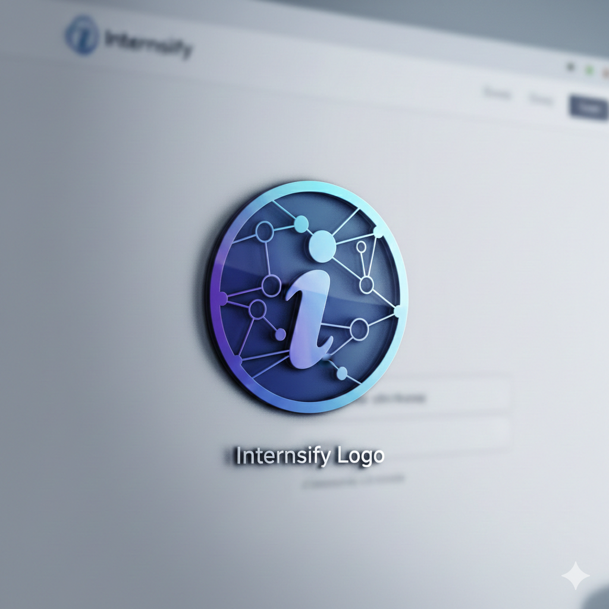

<div align="center">
  <h1>✨ CareerNest Internship Portal</h1>
  <p>Connecting <b>students</b> and <b>employers</b> with a modern, full‑stack platform featuring a centralized recruitment engine, role‑based dashboards, secure authentication, and real‑time notifications.</p>
  
  
  <br/><br/>
  
  
  
  
  
  
</div>

---

## Table of Contents
- Overview
- Features
- UI Highlights
- Tech Stack
- Monorepo Layout
- Quick Start
- Security & Secrets
- Scripts
- Roadmap
- License

## Overview
CareerNest streamlines internship discovery and hiring, offering tailored experiences for students, companies, and admins. It supports secure auth, application tracking, notifications, and certificate generation.

## Features
- Role‑based dashboards for Students, Companies, and Admins
- Secure authentication with email/password and OAuth
- Internship creation, editing, and application tracking
- Real‑time notifications via WebSockets
- Certificate generation and PDF utilities
- Search engine across internships and profiles

## UI Highlights
- Clean public landing page with hero and featured internships
- Student workflows for applying, tracking, and certificates
- Company workflows for posting internships and reviewing applicants
- Admin oversight for companies and students

### UI Gallery
<table>
  <tr>
    <td><br/>Home</td>
    <td><br/>Authentication</td>
  </tr>
  <tr>
    <td><br/>Internships</td>
    <td><br/>Internship Detail</td>
  </tr>
  <tr>
    <td><br/>Student Dashboard</td>
    <td><br/>Certificates</td>
  </tr>
  <tr>
    <td><br/>Company Dashboard</td>
    <td><br/>Company Internships</td>
  </tr>
  <tr>
    <td><br/>Applicants</td>
    <td><br/>Admin Dashboard</td>
  </tr>
  <tr>
    <td><br/>Additional UI</td>
    <td><br/>Landing Preview</td>
  </tr>
</table>

## Tech Stack
- Frontend: React 18, Vite, React Router, Axios, React‑Toastify
- Backend: Spring Boot 3, Spring Security, JPA/Hibernate
- Database: MySQL
- Realtime: WebSocket
- Storage: Local and Firebase Storage integrations

## Monorepo Layout
- Backend: `intersify/`
- Frontend: `intersify-frontend/`
- Docs: `docs/`

## Quick Start

### Backend
1. Create `intersify/.env` with your environment values:
```
DB_URL=jdbc:mysql://localhost:3306/intersifyDb?createDatabaseIfNotExist=true&useSSL=false&allowPublicKeyRetrieval=true
DB_USERNAME=your_db_user
DB_PASSWORD=your_db_password
JWT_SECRET=change-this-to-a-long-random-secret
CLOUDINARY_CLOUD_NAME=your_cloud_name
CLOUDINARY_API_KEY=your_cloudinary_key
CLOUDINARY_API_SECRET=your_cloudinary_secret
FIREBASE_STORAGE_BUCKET=intersify-files
FIREBASE_SERVICE_ACCOUNT_PATH=firebase-service-account.json
FIREBASE_STORAGE_BASE_URL=https://storage.googleapis.com/intersify-files/
GOOGLE_CLIENT_ID=your_google_client_id
GOOGLE_CLIENT_SECRET=your_google_client_secret
FACEBOOK_CLIENT_ID=your_facebook_client_id
FACEBOOK_CLIENT_SECRET=your_facebook_client_secret
MAIL_USERNAME=your_email@example.com
MAIL_PASSWORD=your_app_password
```
2. Start the backend:
```
cd intersify
./mvnw.cmd spring-boot:run
```
The server runs on `http://localhost:8080/`.

### Frontend
1. Install and run:
```
cd intersify-frontend
npm install
npm run dev
```
The app serves on `http://localhost:5173/` by default.

## Security and Secrets
- Secrets are externalized via `intersify/.env` and never committed.
- `intersify/src/main/resources/firebase-service-account.json` must stay local and is ignored.
- Push protection is enabled to prevent accidental secret leaks.

## Screens and Flow Highlights
- Public Home with hero and internships listing
- Student Dashboard: profile, applications, certificates
- Company Dashboard: manage internships and applicants
- Admin Dashboard: oversee companies and students

## Scripts
- Backend build: `./mvnw.cmd -DskipTests package`
- Frontend dev: `npm run dev`
- Frontend build: `npm run build`
- Frontend preview: `npm run preview`

## Roadmap
- Additional social auth providers
- Rich analytics for admins and companies
- Optimized media delivery and caching
- Accessibility enhancements and UX refinements

## License
This project is provided as‑is for learning and demonstration purposes.
