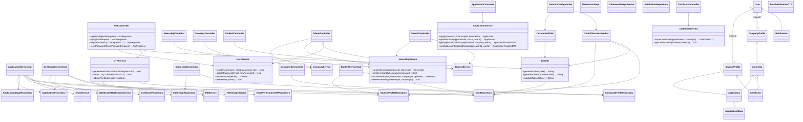

# UML Class Diagram

This diagram summarizes the major classes, grouped by responsibility. It captures controllers, services, repositories, entities, and security components.

```mermaid
classDiagram

%% Packages (logical)
class AuthController
class InternshipController
class ApplicationController
class CertificateController
class CompanyController
class StudentController
class AdminController
class SearchController

class ApplicationService
class ApplicationServiceImpl
class CertificateService
class CertificateServiceImpl
class InternshipService
class InternshipServiceImpl
class CompanyService
class CompanyServiceImpl
class StudentService
class StudentServiceImpl
class UserService
class UserServiceImpl
class OTPService
class FileStorageService
class FirebaseStorageService
class PdfService
class EmailService
class WebSocketNotificationService

class InternshipRepository
class ApplicationRepository
class ApplicationStageRepository
class UserRepository
class StudentProfileRepository
class CompanyProfileRepository
class CertificateRepository
class EmailVerificationOTPRepository
class NotificationRepository

class SecurityConfiguration
class CustomJwtFilter
class JwtUtils
class OAuth2SuccessHandler

class User
class StudentProfile
class CompanyProfile
class Internship
class Application
class ApplicationStage
class Certificate
class Notification
class EmailVerificationOTP

%% Controller -> Service
AuthController --> UserService
AuthController --> OTPService
AuthController --> JwtUtils
ApplicationController --> ApplicationService
CertificateController --> CertificateService
CompanyController --> CompanyService
StudentController --> StudentService
InternshipController --> InternshipService
SearchController --> InternshipService
SearchController --> StudentService
AdminController --> CompanyService
AdminController --> InternshipService
AdminController --> StudentService
AdminController --> UserService

%% Service -> Repository
ApplicationServiceImpl --> ApplicationRepository
ApplicationServiceImpl --> ApplicationStageRepository
ApplicationServiceImpl --> InternshipRepository
ApplicationServiceImpl --> StudentProfileRepository
ApplicationServiceImpl --> UserRepository
ApplicationServiceImpl --> EmailService
ApplicationServiceImpl --> WebSocketNotificationService
CertificateServiceImpl --> CertificateRepository
CertificateServiceImpl --> ApplicationRepository
CertificateServiceImpl --> PdfService
CertificateServiceImpl --> FileStorageService
InternshipServiceImpl --> InternshipRepository
InternshipServiceImpl --> CompanyProfileRepository
CompanyServiceImpl --> CompanyProfileRepository
StudentServiceImpl --> StudentProfileRepository
StudentServiceImpl --> UserRepository
OTPService --> EmailVerificationOTPRepository
OTPService --> UserRepository

%% Security
SecurityConfiguration --> CustomJwtFilter
SecurityConfiguration --> OAuth2SuccessHandler
CustomJwtFilter --> JwtUtils
JwtUtils --> UserRepository
OAuth2SuccessHandler --> UserRepository
OAuth2SuccessHandler --> StudentProfileRepository
OAuth2SuccessHandler --> JwtUtils

%% Entities
User "1" o-- "1" StudentProfile : mapsId
User "1" o-- "1" CompanyProfile : mapsId
CompanyProfile "1" o-- "*" Internship
StudentProfile "1" o-- "*" Application
Internship "1" o-- "*" Application
Application "1" o-- "*" ApplicationStage
StudentProfile "1" o-- "*" Certificate
Internship "1" o-- "*" Certificate
User "1" o-- "*" Notification

%% Methods (selected)
class AuthController{
  +register(RegisterRequest): ApiResponse
  +login(AuthRequest): AuthResponse
  +forgotPassword(OTPRequestDTO): ApiResponse
  +resetPassword(ResetPasswordRequest): ApiResponse
}
class ApplicationService{
  +apply(studentId, internshipId, resumeUrl): Application
  +updateStatus(applicationId, status, userId): Application
  +getApplicationDetails(applicationId, companyUserId): ApplicationDetailsDTO
  +getApplicationTrackingDetails(applicationId, userId): ApplicationTrackingDTO
}
class CertificateService{
  +issueCertificate(applicationId, companyId): CertificateDTO
  +getCertificatesByStudent(studentId): List<CertificateDTO>
}
class InternshipService{
  +createInternship(companyId, internship): Internship
  +getInternshipsByCompany(companyId): List<Internship>
  +updateInternship(internshipId, companyId, updated): Internship
  +deleteInternship(internshipId, companyId): void
}
class UserService{
  +registerUser(name, email, password, role): void
  +updatePassword(email, newPassword): void
  +existsByEmail(email): boolean
  +deleteUser(userId): void
}
class OTPService{
  +generateAndSendOTP(OTPRequestDTO): void
  +verifyOTP(OTPVerificationDTO): void
  +isEmailVerified(email): boolean
}
class JwtUtils{
  +generateToken(User): String
  +generateToken(Authentication): String
  +validateToken(token): Claims
}
```

