# Web Architecture: REST API and Navigation

## REST API Endpoints

### Auth
- POST `/auth/signup` — Create user (requires verified email)
- POST `/auth/signin` — Local login, returns JWT
- POST `/auth/forgot-password` — Send OTP to email
- POST `/auth/reset-password` — Verify OTP and set new password
- POST `/auth/otp/send` — Send email verification OTP (public)
- POST `/auth/otp/verify` — Verify email OTP (public)

### OAuth2
- `/oauth2/**`, `/login/oauth2/**` — Spring OAuth2 login (redirect dance)
- Success handler redirects to `/oauth-success?token=<jwt>`

### Students (role: STUDENT)
- GET `/students/profile` — My profile
- PUT `/students/profile` — Update my profile
- POST `/students/profile/picture` — Upload profile picture (multipart)
- POST `/students/profile/resume` — Upload resume (multipart)
- GET `/applications/check/{internshipId}` — Check if applied
- GET `/applications/student` — My applications
- GET `/certificates/my` — My certificates
- POST `/applications/{internshipId}/apply?resumeUrl=<url>` — Apply to internship

### Companies (role: COMPANY)
- GET `/companies/profile` — My company profile
- PUT `/companies/profile` — Update company profile
- POST `/companies/profile/logo` — Upload company logo (multipart)
- GET `/internships/company` — List my internships
- DELETE `/internships/{id}` — Delete internship
- GET `/applications/{applicationId}` — View application details
- GET `/applications/{applicationId}/tracking` — View tracking info/stages
- GET `/applications/{applicationId}/history` — View application stage history
- POST `/certificates/issue/{applicationId}` — Issue certificate (requires valid status)

### Admin (role: ADMIN)
- GET `/admin/companies` — List companies (optional status filter)
- PUT `/admin/companies/{companyId}/status?status=<status>` — Update company status
- GET `/admin/companies/{companyId}` — Get company details
- GET `/admin/companies/{companyId}/internships` — Get internships for a company
- GET `/admin/internships` — List all internships
- DELETE `/admin/internships/{id}` — Remove an internship
- GET `/admin/students` — List all students
- DELETE `/admin/users/{userId}` — Delete a user

### Public / Search
- GET `/internships/public` — Public internships (listing)
- GET `/search/recommendations` — Recommendations for logged-in students
- Static uploads: `/uploads/**`

## Frontend Pages and Navigation

Routes configured in [App.jsx](file:///c:/Users/HP/OneDrive/Desktop/New%20combined%20frontend/intersify-frontend/src/App.jsx).

```mermaid
flowchart TD
  A[Navbar] --> B["Public"]
  B --> B1["/"]
  B --> B2["/internships"]
  B --> B3["/internships/:id"]

  A --> C["Auth"]
  C --> C1["/login"]
  C --> C2["/register"]
  C --> C3["/forgot-password"]
  C --> C4["/reset-password"]
  C --> C5["/oauth-success"]
  C --> C6["/unauthorized"]

  A --> D["Student (Protected)"]
  D --> D1["/student/dashboard"]
  D --> D2["/student/applications"]
  D --> D3["/student/profile"]
  D --> D4["/student/certificates"]

  A --> E["Company (Protected)"]
  E --> E1["/company/dashboard"]
  E --> E2["/company/profile"]
  E --> E3["/company/internships"]
  E --> E4["/company/internships/new"]
  E --> E5["/company/internships/:id/edit"]
  E --> E6["/company/internships/:id/applications"]
  E --> E7["/company/applications/:applicationId"]

  A --> F["Admin (Protected)"]
  F --> F1["/admin/dashboard"]
  F --> F2["/admin/companies"]
  F --> F3["/admin/company/:id"]
  F --> F4["/admin/students"]
```

## Request Lifecycle
- Axios attaches JWT → `Authorization: Bearer <token>` (see [axios.js](file:///c:/Users/HP/OneDrive/Desktop/New%20combined%20frontend/intersify-frontend/src/api/axios.js))
- Spring Security validates via [CustomJwtFilter](file:///c:/Users/HP/OneDrive/Desktop/New%20combined%20frontend/intersify/src/main/java/com/intersify/security/CustomJwtFilter.java)
- `SecurityContext` gets `JwtDTO`, `@PreAuthorize` enforces roles → Controller → Service → Repository

